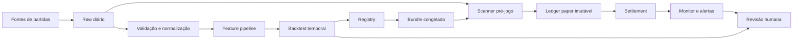

# Arquitetura

## Visão do sistema

O Football Decision Lab usa dois ciclos independentes:

- **ciclo de pesquisa**: prepara dados, valida features, executa divisões temporais, treina challengers e produz relatórios;
- **ciclo de operação paper**: usa um modelo congelado, registra previsões antes dos jogos, liquida resultados e monitora métricas.

Separar os ciclos evita que uma reexecução de treinamento altere silenciosamente o experimento que está em andamento.

## Fluxo de dados

## Componentes

| Componente | Responsabilidade | Controle principal |
|---|---|---|
| Ingestão | Atualizar calendário e dados do dia | execução repetível |
| Validação | Rejeitar esquema ou campos inválidos | fail closed |
| Feature pipeline | Construir variáveis sem olhar o futuro | corte temporal |
| Backtest | Medir desempenho fora da amostra | splits por data |
| Registry | Registrar métricas e artefatos | hashes e versão |
| Scanner | Capturar sinais 30–90 min antes do jogo | janela de captura |
| Paper ledger | Preservar exatamente o sinal capturado | linhas imutáveis |
| Settlement | Atualizar resultados encerrados | retries + pendências |
| Monitor | Calcular ROI, drawdown e calibração | limiares por amostra |
| Challenger | Testar novos modelos | sem promoção automática |

## Retomada após desligamento

Um orquestrador executado em intervalos curtos calcula quais janelas ficaram vencidas. Cada job possui uma chave de slot, limite de tentativas e estado persistido. Ao ligar o computador novamente, janelas recuperáveis são executadas; partidas já iniciadas não são recriadas como se tivessem sido previstas antes do jogo.

## Estado atual

- modo: `PAPER_ONLY`;
- stake fixa simulada: R$ 5,00;
- máximo diário: 10 sinais;
- mercado do ciclo: `TG_FT_O25`;
- revisão não antes de 01/10/2026;
- promoção automática: desativada.
